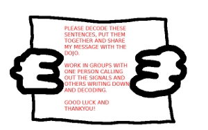
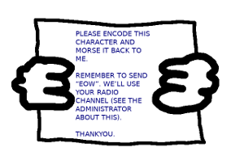
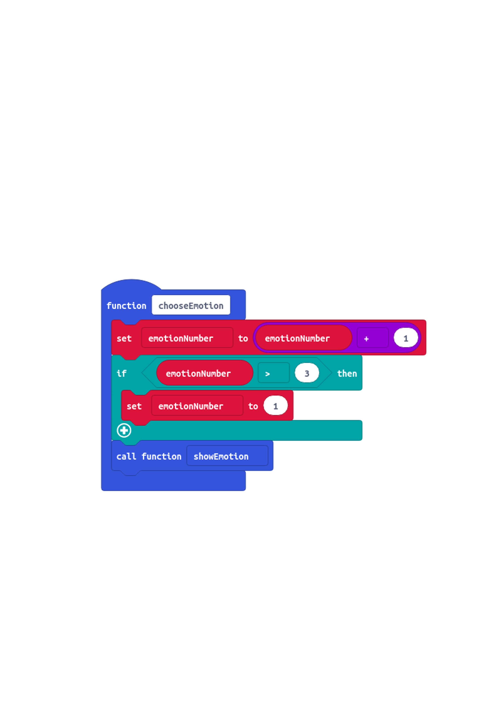

CoderDojo Projects Repository
========

#Welcome.
===

The purpose of this GitHub repository is to be a source of project resources and ideas for _anyone_ involved with CoderDojo or Code Club type events.
Feel free to download or fork any of the work contained here. Some of these projects may be updated over time.

##Volunteer Mentoring
===

As CoderDojo mentors we try to encourage that problem solving mindset ... coming up with project ideas and testing out ideas runs alongside understanding the software, hardware and conceptual tools.

**Getting creative** by solving problems. 

Projects generally start with a _problem scenario_, then go though the phases leading to a solution. The solutions discovered here are best used as references.

So, here are some of the projects we've worked on so far...

##Morse Code

This requires ninjas to program micro:bit microcontroller to be a Morse Code transceiver, both transmitting and receiving signals. At the same time, mentors and volunteers can program the other Morse-speaking micro:bit 'characters' with which ninjas can interact. These include:

[CoderDojo Morse Code workbook cover sheet](morse_code/morse_alphabet_and_numbers_w250.png)

- Messenger Challenge - Outputs Morse messages, which ninjas must work in teams to decode.

- Echo Challenge - Displays random alphanumeric characters, to which ninjas must successfully respond in Morse.

- The Channel Administrator - Able to control to radio communication channel of Echo Challenge.
- The Translator - Able to decode user input Morse signals into alphanumeric characters.

##Emotion Communicator

This project was created to support Autism Awareness Week. 
Ninjas program one of two micro:bit devices:
- The Emotion Transmitter communicates an emotion being experienced
- The Emotion Receiver acknowledges that communication.
Design and craft activities to make devices wearable makes sense on many of these projects.

##Recycling Tally Counter

This Project presents a recycling challenge scenario. 
Ninjas are told that Leeds City Council have asked our dojo to provide a device that can help count how many metal cans are recycled each day in their offices. The challenges progress to include tallies for plastic bottles and paper cups, then radio transmission of data to central micro:bit 'server'.

