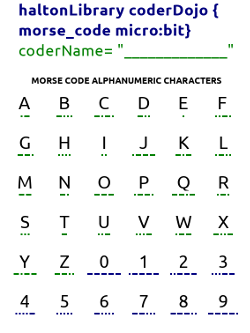
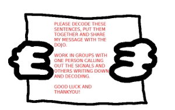
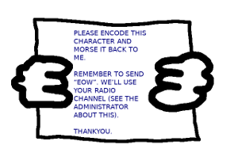
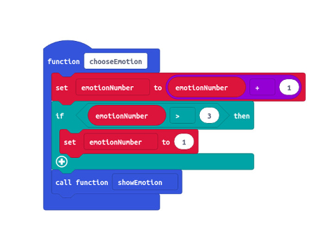
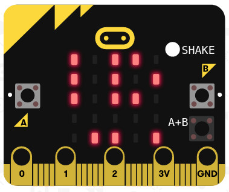
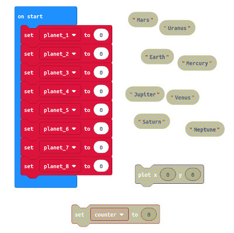
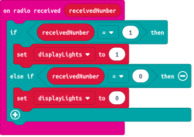
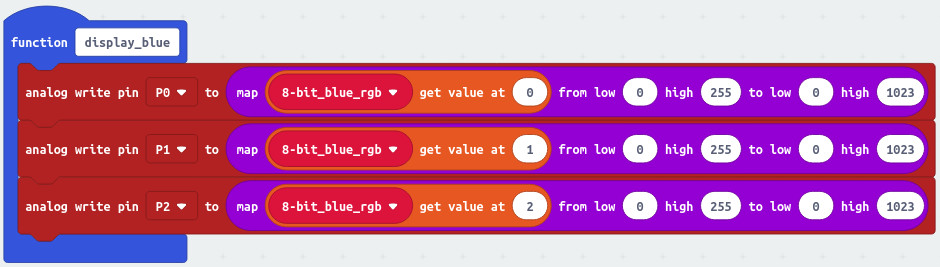

CoderDojo Projects Repository
===

Welcome
===

The purpose of this GitHub repository is to be a source of project resources and ideas for _anyone_ involved with CoderDojo or Code Club type events.
Feel free to download or fork any of the work contained here. Some of these projects may be updated over time.

Volunteer Mentoring
===

As CoderDojo mentors we try to encourage that problem solving mindset, so coming up with and testing out project ideas runs alongside understanding the software and hardware tools.

**Getting creative** by solving problems. 

Projects generally start with a _problem scenario_, then go though the phases leading to a solution. The solutions discovered here are best used as references.

So, here are some of the projects I've developed so far...

Morse Code
===

This requires young code ninjas to program micro:bit microcontroller to be a Morse Code transceiver, both transmitting and receiving signals. At the same time, mentors and volunteers can program the other Morse-speaking micro:bit 'characters' with which ninjas can interact. These include:

- Messenger Challenge - Outputs Morse messages, which ninjas must work in teams to decode.

- Echo Challenge - Displays random alphanumeric characters, to which ninjas must successfully respond in Morse.

- The Channel Administrator - Able to control the radio communication channel of Echo Challenge.
- The Translator - Able to decode user input Morse signals into alphanumeric characters.

Emotion Communicator
===

This project was created to support Autism Awareness Week. 
Young software developers program one of two micro:bit devices:
- The Emotion Transmitter communicates an emotion being experienced
- The Emotion Receiver acknowledges that communication.

Design and craft activities to make devices wearable makes sense on many of these projects.

Recycling Tally Counter
===

This Project presents a recycling challenge scenario. 
CoderDojo developers are told that Leeds City Council have asked our dojo to provide a device that can help count how many metal cans are recycled each day in their libraries. The challenges progress to include tallies for plastic bottles and paper cups, then radio transmission of data to the Seacroft recycling centre micro:bit - a continuous display of uploaded data, such as coderName, libraryName etc..

Sort Planets
===

This project took a space theme, in line with other local celebrations of the Moon Landing 50th Anniversary.
Young coders were challenged to arrange solar system planets into an array data structure. From that point, many ideas for quizzes and games could be imagined and coded.

Lightning Bug
===

Ever thought you'd be able to demonstrate a micro:bit Denial of Service (DoS) scenario in your coding workshops?

Young developers are asked to program their micro:bits to be part of an artistic lighting display being made for a local public event. Unfortunately there is a flaw in the code that would allow 'Mischievous Malory' to sabotage the event for her own amusement.

Young developers must first ethically disclose and demonstrate exploitation of the flaw, then fix the original code, so helping to protect their local public event.

Air Pollution Alert Robot
===

People with respiratory illnesses like asthma suffer most when air quality is adversely affected by high pollution levels.

This project builds device that can put asthmatic kid's back in control, by alerting them to be prepared. It continuously monitors the air quality index (aqi) in their city, then indicates this information to them directly, in real-time. 

The code and device is developed in gradual stages.

This project involves at least some block code/python and bash shell programming, then some reading of html, css and javascript.
